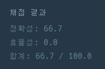
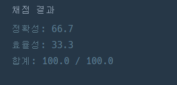

# 스택/큐

[toc]

## 프로그래머스_기능개발

> [프로그래머스_기능개발](https://programmers.co.kr/learn/courses/30/lessons/42586?language=python3)

- `Python3`

```python
'''
progresses에서 앞에서 뽑아서 speeds의 앞에서 뽑은것만큼 더함 며칠 걸리는지 확인
앞의 진행상황을 일수가 아직 끝나지 않으면 뒤에 것이 끝나더라도 나중에 배포

'''
def solution(progresses, speeds):
    answer = []
    days = []
    for i in range(len(progresses)):
        day = 0
        progress = progresses[i]
        speed = speeds[i]
        while progress < 100:
            progress += speed
            day += 1
        days.append(day)
    print(days)
    start = days.pop(0)
    cnt = 1
    while True:
        if days:
            next = days.pop(0)
        else:
            answer.append(cnt)
            break
        if start >= next:
            cnt += 1
        else:
            start = next
            answer.append(cnt)
            cnt = 1
    return answer

```

- `Javascript`

```javascript
function solution(progresses, speeds) {
    const answer = [];
    let time = 0;
    let cnt = 0;
    while (progresses.length > 0) {
      if ((progresses[0] + (time * speeds[0])) >= 100 ) {
          cnt += 1;
          progresses.shift();
          speeds.shift();
      }  else {
          if ( cnt > 0 ) {
              answer.push(cnt);
              cnt = 0;
          }
          time += 1;
      }
    };
    answer.push(cnt);
    return answer;
}
```


- 다른 코드(`Python3`)

```python
def solution(progresses, speeds):
    Q=[]
    for p, s in zip(progresses, speeds):
        if len(Q)==0 or Q[-1][0]<-((p-100)//s):
            Q.append([-((p-100)//s),1])
        else:
            Q[-1][1]+=1
    return [q[1] for q in Q]
```

```python
def solution(progresses, speeds):
    print(progresses)
    print(speeds)
    answer = []
    time = 0
    count = 0
    while len(progresses)> 0:
        if (progresses[0] + time*speeds[0]) >= 100:
            progresses.pop(0)
            speeds.pop(0)
            count += 1
        else:
            if count > 0:
                answer.append(count)
                count = 0
            time += 1
    answer.append(count)
    return answer
```

- 다른풀이(`Javascript`)

```javascript
function solution(progresses, speeds) {
    let answer = [0];
    let days = progresses.map((progress, index) => Math.ceil((100 - progress) / speeds[index]));
    let maxDay = days[0];

    for(let i = 0, j = 0; i< days.length; i++){
        if(days[i] <= maxDay) {
            answer[j] += 1;
        } else {
            maxDay = days[i];
            answer[++j] = 1;
        }
    }

    return answer;
}
```


```javascript
function solution(progresses, speeds) {
    var answer = [];

    while(speeds.length > 0) {
        // 개발
        for(let i in speeds) {
            if(progresses[i] < 100) {
                progresses[i] += speeds[i];
            }
        }

        // 배포
        let deploy_count = 0;
        while(progresses[0] >= 100) {
            progresses.shift();
            speeds.shift();
            deploy_count++;
        }
        if(deploy_count > 0) {
            answer.push(deploy_count);
        }
    }

    return answer;
}
```


## 프로그래머스_프린터

> [프로그래머스_프린터](https://programmers.co.kr/learn/courses/30/lessons/42587)

```python
'''
1. 인쇄 대기목록의 가장 앞에 있는 문서(J)를 대기목록에서 꺼냅니다.
2. 나머지 인쇄 대기목록에서 J보다 중요도가 높은 문서가 한 개라도 존재하면 J를 대기목록의 가장 마지막에 넣습니다.
3. 그렇지 않으면 J를 인쇄합니다.
4개의 문서(A, B, C, D)가 순서대로 인쇄 대기목록에 있고 중요도가 2 1 3 2 라면 C D A B 순으로 인쇄
숫자가 클수록 중요도가 높다
location은 대기 목록의 가장 앞에 있으면 0두번쨰에 있으면 1(0~현재 대기목록에 있는작업수-1)
중요도 담긴 배열 priorities, 인쇄 요청 문서가 현재 대기 목록의 어떤 위치에 있는지 알려주는 location 주어짐

1. priorities에서 제일 앞에가 max값이 나올때 그걸 pop해서 result에 append, location - 1(만약 location이 -1이되면 들어간것!(result의 len이 값))
2. 만약 location이 0이되면 location = len(priorities) - 1 크면, location -1
'''
def solution(priorities, location):
    answer = 0
    result = []
    while location != -1:
        MAX = max(priorities)
        if priorities[0] != MAX:
            priorities.append(priorities.pop(0))
            if location == 0:
                location = len(priorities) - 1
            else:
                location -= 1
        else:
            result.append(priorities.pop(0))
            location -= 1
    answer = len(result)
    return answer
```

- 다른풀이

> ### any vs all
>
> #### all
>
> - **all(iterable)** 함수는 인자로 받은 **반복 가능한 자료형(iterable)의 모든 요소**가 참(True)이면 참(True)을 반환하는 함수
>
> #### any
>
> - **any(iterable) 함수는** **인자로 받은** **반복가능한 자료형(iterable)중 단 하나라도 참(True)이 있으면 참(True)를 반환**하는 함수 입니다. **반대로 모든 요소가 거짓(False)인 경우에만 거짓(False)을 반환합니다.**

```python
def solution(priorities, location):
    queue =  [(i,p) for i,p in enumerate(priorities)]
    answer = 0
    while True:
        cur = queue.pop(0)
        if any(cur[1] < q[1] for q in queue):
            queue.append(cur)
        else:
            answer += 1
            if cur[0] == location:
                return answer
```


## 프로그래머스_다리를지나는트럭

> [프로그래머스_다리를지나는트럭](https://programmers.co.kr/learn/courses/30/lessons/42583)

```python
'''
bridge_length에서 weight까지 견디는 다리가 있다 최소 몇초?
1. 트럭 배열에서 다리로 올릴 때 다리에 sum, len 확인후 sum + 해당트럭무게<=weight, len< bridge_length이면 올리기
2. 만약 올릴수 없다면 0을 올림
3. time+1을 하는데, len(bridge)가 bridge_length면 제일 앞에것 pop,
'''
def solution(bridge_length, weight, truck_weights):
    answer = 0
    bridge = [0]*(bridge_length)
    SUM = 0
    while bridge:
        answer += 1
        SUM -= bridge.pop(0)
#         다리에 올라갈 수 있음
# if truck_weights and SUM + truck_weights[0] <= weight: 이렇게 하면 시간초과 WHY??
        if truck_weights:
            if SUM + truck_weights[0] <= weight:
                truck = truck_weights.pop(0)
                SUM += truck
                bridge.append(truck)
            else:
                bridge.append(0)
        
    return answer
```

- 다른코드

```python
import collections

DUMMY_TRUCK = 0


class Bridge(object):

    def __init__(self, length, weight):
        self._max_length = length
        self._max_weight = weight
        self._queue = collections.deque()
        self._current_weight = 0

    def push(self, truck):
        next_weight = self._current_weight + truck
        if next_weight <= self._max_weight and len(self._queue) < self._max_length:
            self._queue.append(truck)
            self._current_weight = next_weight
            return True
        else:
            return False

    def pop(self):
        item = self._queue.popleft()
        self._current_weight -= item
        return item

    def __len__(self):
        return len(self._queue)

    def __repr__(self):
        return 'Bridge({}/{} : [{}])'.format(self._current_weight, self._max_weight, list(self._queue))


def solution(bridge_length, weight, truck_weights):
    bridge = Bridge(bridge_length, weight)
    trucks = collections.deque(w for w in truck_weights)

    for _ in range(bridge_length):
        bridge.push(DUMMY_TRUCK)

    count = 0
    while trucks:
        bridge.pop()

        if bridge.push(trucks[0]):
            trucks.popleft()
        else:
            bridge.push(DUMMY_TRUCK)

        count += 1

    while bridge:
        bridge.pop()
        count += 1

    return count


def main():
    print(solution(2, 10, [7, 4, 5, 6]), 8)
    print(solution(100, 100, [10]), 101)
    print(solution(100, 100, [10, 10, 10, 10, 10, 10, 10, 10, 10, 10]), 110)


if __name__ == '__main__':
    main()
```


## 프로그래머스_주식가격

> [프로그래머스_주식가격](https://programmers.co.kr/learn/courses/30/lessons/42584?language=python3)

- 이렇게 풀면 답은 모두 맞지만 효율성은 0

> 

```python
'''
가격이 떨어지지 않는 기간은 몇초?
prices는 초단위로 기록된 주식가격이 담긴 배열
자기보다 뒤에서 자기자신보다 작은 수가 나오면 가격이 떨어진것
1. prices를 pop해서 쭉 뒤로 보면서 자기보다 작은 것이 나오면 초수를 answer에 담아줌
'''
def solution(prices):
    answer = []
    
    while prices:
        now = prices.pop(0)
        sec = 0
        for next in prices:
            sec += 1
            if now > next:
                break
        answer.append(sec)
            
    return answer
```

- 효율성 통과

> 

```python
def solution(prices):
    answer = []
    for i in range(len(prices)):
        sec = 0
        for j in range(i+1,len(prices)):
            sec += 1
            if prices[i] > prices[j]:
                break
        answer.append(sec)
    return answer
```


## BOJ_10828_스택

> [BOJ_10828_스택](https://www.acmicpc.net/problem/10828)

```python
'''
정수를 저장하는 스택,
스택은 LIFO(마지막에 들어간것이 먼저나감)
push X : X를 스택에 넣는 연산
pop : 스택에서 가장 위에 있는 정수를 빼고, 그 수를 출력, 만약 스택에 들어있는 정수가 없는 경우 -1 출력
size : 스택에 들어있는 정수의 개수 출력
empty : 스택이 비어있으면 1, 아니면 0 출력
top : 스택의 가장 위에 있는 정수 출력, 만약 없으면 -1
'''
import sys
input = sys.stdin.readline

N = int(input())
stack = []
for _ in range(N):
    order = input()
    if "push" in order:
        stack.append(int(order[5:]))
    elif "pop" in order:
        if stack:
            print(stack.pop())
        else:
            print(-1)
    elif "size" in order:
        print(len(stack))
    elif "empty" in order:
        if stack:
            print(0)
        else:
            print(1)
    elif "top" in order:
        if stack:
            print(stack[-1])
        else:
            print(-1)
    #print(order,stack)
```

- 다른 코드

```python
from sys import stdin

stack = []
next(stdin)
for line in stdin:
    command = line.split()
    if command[0] == 'push':
        stack.append(command[1])
    elif command[0] == 'pop':
        if stack: print(stack.pop())
        else: print(-1)
    elif command[0] == 'size':
        print(len(stack))
    elif command[0] == 'empty':
        if stack: print(0)
        else: print(1)
    elif command[0] == 'top':
        if stack: print(stack[-1])
        else: print(-1)
```


## BOJ_2493_탑

> [BOJ_2493_탑](https://www.acmicpc.net/problem/2493)

```python
'''
리스트의 오른쪽부터 왼쪽방향으로 레이저 발사,
출력 : 몇번쨰 탑이 신호를 받는지
1. 리스트를 뒤에서부터 보는데 그앞의 수가 자기보다 같거나 커야 수신받음!, 만약 없다면 0
'''
import sys
input = sys.stdin.readline
'''
# 시간초과
N = int(input())
top = list(map(int,input().split()))
answer = []
for i in range(N-1,-1,-1):
    now = top[i]
    idx = i-1
    ans = 0
    while idx >= 0:
        next = top[idx]
        if now <= next:
            ans = idx + 1
            break
        else:
            idx -= 1
    answer.append(ans)
answer.reverse()
print(*answer)
'''
N = int(input())
top = list(map(int,input().split()))
answer = []
stack = [] #(idx,값) 넣음
for i in range(N):
    while stack:
        # 수신가능
        if stack[-1][1] >= top[i]:
            answer.append(stack[-1][0] + 1)
            break
        else:
            stack.pop()
    # 스택이 비면 수신할 탑이 없다.
    if not stack:
        answer.append(0)
    stack.append([i,top[i]])
print(" ".join(map(str,answer)))
```

- 다른 코드

```python
import sys

def deep(index, num):
    if index == 0:
        return 0

    if nums[index] >= num:
        return index
    else:
        return deep(result[index], num)


N = int(sys.stdin.readline())+1
nums = list(map(int, sys.stdin.readline().split()))
nums.insert(0, 0)

# print(nums)

result = [0] * N

for i in range(2, N):
    if nums[i-1] > nums[i]:
        result[i] = i-1
    else:
        result[i] = deep(result[i-1], nums[i])


print(' '.join(map(str, result[1:])))
```

```python
from math import inf

def sol(ht) :
    ht.insert(0, inf)
    st = [0]
    res = []
    for i in range(1, len(ht)) :
        while ht[st[-1]] <= ht[i] :
            st.pop()
        res.append(st[-1])
        st.append(i)
    ht.pop(0)
    return res

n = int(input())
ht = [int(x) for x in input().split()]
res = sol(ht)
print(' '.join(str(x) for x in res))
```

```python
import sys
I = sys.stdin.readline
N = int(I())
arr = list(map(int, I().split()))
arr.insert(0,999999999)
result = [-1] * (N+1)
stack = [0]

for a in range(1,N+1):
    while arr[stack[-1]] <= arr[a]:
        stack.pop()      
    
    result[a] = stack[-1]
    stack.append(a)

del result[0]
print(' '.join(map(str,result)))
```

## BOJ_17298_오큰수

> [BOJ_17298_오큰수](https://www.acmicpc.net/problem/17298)

```python
'''
크기가 N인 수열
Ai의 오큰수는 오른쪽에 있으면서 Ai보다 큰 수 중 가장 왼쪽에 있는 수
그러한 수가 없으면 -1
[3,5,2,7] : NGE(1) = 5, NGE(2) = 7 NGE(3) = 7, NGE(4) = -1
1. (0,N-1)으로 보는데 현재 것이 다음 수 보다 작다면 result에 다음 수 담기
2. 만약 다음수가 작다면 그 다음수를 비교
'''
import sys
input = sys.stdin.readline

'''
# 시간초과
sys.setrecursionlimit(10**6)

def check(idx,num):
    if idx == N:
        return -1
    if arr[idx] > num:
        return arr[idx]
    else:
        return check(idx+1,num)

N = int(input())
arr = list(map(int,input().split()))
result = [0] * (N-1)+[-1]

for i in range(N-1):
    if arr[i+1] > arr[i]:
        result[i] = arr[i+1]
    else:
        result[i] = check(i+1,arr[i])
print(" ".join(map(str,result)))

# 시간초과
def check(li):
    res = []
    for i in range(len(li)-1):
        idx = i
        while idx < N-1:
            if li[i] >= li[idx+1]:
                idx += 1
            else:
                res.append(li[idx+1])
                break
        if idx == N-1:
            res.append(-1)
    res.append(-1)
    return res

N = int(input())
arr = list(map(int,input().split()))
res = check(arr)
print(' '.join(str(x) for x in res))
'''
def check(li):
    res = [0]*len(li)
    stack = []
    for i in range(len(li)-1,-1,-1):
        while stack and stack[-1] <= li[i]:
            stack.pop()
        if not stack:
            res[i] = -1
        else:
            res[i] = stack[-1]
        stack.append(li[i])
    return res

N = int(input())
arr = list(map(int,input().split()))
res = check(arr)
print(' '.join(map(str,res)))
```

- 다른코드

```python
import sys


def main():
    sys.stdin.readline()
    members = list(map(int, sys.stdin.readline().split()))
    stack = []
    for i, member in reverse_enumerate(members):
        while stack and stack[-1] <= member:
            stack.pop()
        members[i] = str(stack[-1]) if stack else '-1'
        stack.append(member)
    print(' '.join(members))


def reverse_enumerate(seq):
    return zip(reversed(range(len(seq))), reversed(seq))


if __name__ == '__main__':
    sys.exit(main())
```

```python
import sys


def sol17298():
    n, *seq = map(int, sys.stdin.read().split())
    answer, st = ['-1'] * n, []
    idx = 0
    for num in seq:
        while st and st[-1][1] < num:
            answer[st.pop()[0]] = str(num)
        st.append((idx, num))
        idx += 1
    print(' '.join(answer))
    
   
if __name__ == '__main__':
    sol17298()
    
```


## 프로그래머스_짝지어제거하기

> [프로그래머스_짝지어제거하기](https://programmers.co.kr/learn/courses/30/lessons/12973)

```python
'''
1.문자열을 앞에서부터 보면서 answer에 담고, 문자열의 다음 문자와 answer의 제일 뒤와 비교, 같다면 pop
2. 모두 제거 할 수 없다면 0, 있다면 1 반환
'''
def solution(s):
    answer = []
    S = list(s)
    if len(S) % 2:
        return 0
    for i in range(len(S)):
        if answer and S[i] == answer[-1]:
            answer.pop()
            continue
        answer.append(S[i])
        if len(S) - i < len(answer):
            return  0
    return 1 
```

- 다른코드

```python
def solution(s):
    answer = []
    for i in s:
        if not(answer):
            answer.append(i)
        else:
            if(answer[-1] == i):
                answer.pop()
            else:
                answer.append(i)    
    return not(answer)
```


## 프로그래머스_행렬테두리회전하기

> [프로그래머스_행렬테두리회전하기](https://programmers.co.kr/learn/courses/30/lessons/77485)

```python
'''
1. queries에 따라 회전을 함, 오른쪽으로 테두리만 회전, 
[x1, y1, x2, y2]x1 행 y1 열부터 x2 행 y2 열
1-1 회전을 할 때 
1) x1행, y2열보다 작을 때는 열 + 1,
2) x2행, y1열보다 클 때는 열 - 1
3) y1열, x1행보다 클때는 행 - 1
4) y2열, x2행보다 작을 때는 행 + 1
'''
def rotate(arr, x1,y1,x2,y2):
    temp = []
    MIN = 987654321
    for x in arr:
        temp.append(x[:])
    for i in range(x1,x2+1):
        for j in range(y1,y2+1):
            flag = False
            if i == x1 and j < y2:
                temp[i][j+1] = arr[i][j]
                flag = True
            elif i == x2 and j > y1:
                temp[i][j-1] = arr[i][j]
                flag = True
            elif j == y1 and i > x1:
                temp[i-1][j] = arr[i][j]
                flag = True
            elif j == y2 and i < x2:
                temp[i+1][j] = arr[i][j]
                flag = True
            if flag and MIN > arr[i][j]:
                MIN = arr[i][j]
    return temp,MIN
    
def solution(rows, columns, queries):
    answer = []
    num = 1
    arr = [list(x for x in range(columns)) for _ in range(rows)]
    for i in range(rows):
        for j in range(columns):
            arr[i][j] = num
            num += 1
    for query in queries:
        x1,y1,x2,y2 = query
        arr, MIN = rotate(arr,x1-1,y1-1,x2-1,y2-1)
        answer.append(MIN)
    return answer
```

- 다른풀이

```python
def solution(rows, columns, queries):
    answer = []

    board = [[i+(j)*columns for i in range(1,columns+1)] for j in range(rows)]
    # print(board)

    for a,b,c,d in queries:
        stack = []
        r1, c1, r2, c2 = a-1, b-1, c-1, d-1


        for i in range(c1, c2+1):

            stack.append(board[r1][i])
            if len(stack) == 1:
                continue
            else:
                board[r1][i] = stack[-2]


        for j in range(r1+1, r2+1):
            stack.append(board[j][i])
            board[j][i] = stack[-2]

        for k in range(c2-1, c1-1, -1):
            stack.append(board[j][k])
            board[j][k] = stack[-2]

        for l in range(r2-1, r1-1, -1):
            stack.append(board[l][k])
            board[l][k] = stack[-2]

        answer.append(min(stack))


    return answer
```

## 프로그래머스_같은숫자는 싫어

> [프로그래머스_같은숫자는싫어](https://school.programmers.co.kr/learn/courses/30/lessons/12906)

```python
'''
1. 숫자 0~9로 이루어진 arr 배열이 주어짐
2. arr에서 연속적으로 나타나는 숫자 하나만 남기고 제거
3. 배열 반환할 때 원소 순서 유지

방법
1. before = 첫 원소
2. idx 1부터 for문 돌면서 now(현재원소로 할당)
3. before와 비교해서 같으면 before를 now로 설정하고 지나감
4. 다를 경우, now를 answer에 넣고 before를 now로 설정하고 지나감
'''
def solution(arr):
    before = arr[0]
    answer = [before]
    for i in range(1,len(arr)):
        now = arr[i]
        if before != now:
            answer.append(now)
        before = now

    return answer
```

- 다른코드

```python
def no_continuous(s):
    # 함수를 완성하세요
    a = []
    for i in s:
        if a[-1:] == [i]: continue
        a.append(i)
    return a
```

## 프로그래머스_올바른괄호

> [프로그래머스_올바른괄호](https://school.programmers.co.kr/learn/courses/30/lessons/12909)

```python
'''
1. 바른 괄호 ( 문자로 열렸으면 반드시 짝지어서 )로 닫아야 됨 true / 아니면 false  return

방법
1. s가 ( 로 시작 )가 나올때까지 리스트에 넣어둠
2. for문 돌면서 다음 문자가 ( 면 리스트에 넣고, ) 면 리스트에 pop해서 ( 인지 확인 아니면 false
'''
def solution(s):
    answer = True
    stack = []

    for i in range(len(s)):
        now = s[i]
        if now == '(':
            stack.append(now)
        else:
            if len(stack):
                stack.pop()
            elif i != len(s):
                answer = False
                break
    if len(stack):
        answer = False

    return answer
```

- 다른코드

```python
def is_pair(s):
    pair = 0
    for x in s:
        if pair < 0: break
        pair = pair + 1 if x == "(" else pair - 1 if x == ")" else pair
    return pair == 0
def is_pair(s):
    st = list()
    for c in s:
        if c == '(':
            st.append(c)

        if c == ')':
            try:
                st.pop()
            except IndexError:
                return False

    return len(st) == 0
```
