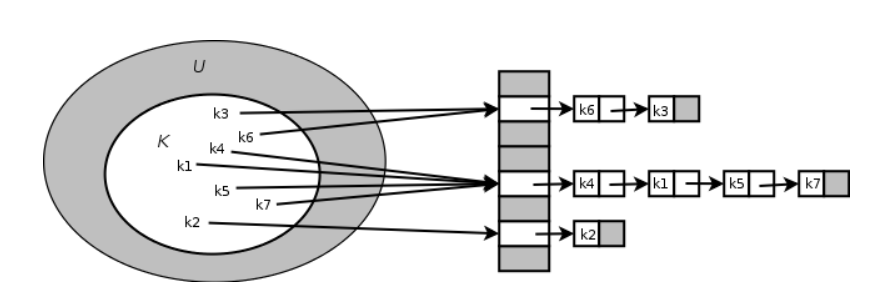

# 해쉬

## 목차

1. [정의](#정의)
2. [프로그래머스_42576_완주하지못한선수](#프로그래머스_42576_완주하지못한선수)
3. [프로그래머스_42577_전화번호목록](#프로그래머스_42577_전화번호목록)


## 정의

> [출처](https://hsp1116.tistory.com/35)

### 해쉬란?

임의의 크기를 가진 데이터를 고정된 데이터의 크기로 변환시키는 것을 말함

즉 해쉬 알고리즘은 해쉬를 하는 방법에 대해 절차적으로 명세함

이를 이용해 특정한 배열의 인덱스나 위치나 위치를 입력하고자 하는 데이터의 값을 이용해 저장하거나 찾을 수 있다

기존에 사용했던 자료 구조들은 탐색이나 삽입에 선형시간이 걸리기도 했던 것에 비해, 해쉬를 이용하면 즉시 저장하거나 찾고자 하는 위치를 참조할 수 있으므로 더욱 빠른 속도로 처리할 수 있다.

### Direct Addressing Table

> key-value쌍의 데이터를 배열에 저장할, key값을 직접적으로 배열의 인덱스로 사용하는 방법

\

예를들면, 키 값이 400인 데이터가 있다면, 이는 배열의 인덱스가 400인 위치에 키 값을 저장하고 포인터로 데이터를 연결한다.

똑같은 키 값이 존재하지 않는다면, 삽입 시에는, 각 키마다 자신의 공간이 존재하므로 그 위치에다 저장을 하면 되고, 삭제 시에는 해당 키의 위치에 NULL값을 넣어주면 된다. 탐색 시에는 해당 키의 위치를 그냥 찾아가서 참조하면 된다.

**찾고자 하는 데이터의 key만 알고있으면 즉시 위치를 찾는 것이 가능하므로 탐색, 저장, 삭제, 갱신은 모두 선형시간인 O(1)로 매우 빠른 속도로 처리가 가능하다.**

다만 **key값의 최대 크기만큼 배열이 할당 되기 때문에, 크기는 매우 큰데, 저장하고자 하는 데이터가 적다면 공간을 많이 낭비할 수 있다는 단점이 있다.**


### 2. Hash Table

> key-value 쌍에서 key값을 테이블에 저장할 때, Direct Addressing Table과 달리 key값을 함수를 이용해 계산을 수행한 후, 그 결과값을 배열의 인덱스로 사용하여 저장하는 방식이다.
>
> 여기서 key값을 계산하는 함수는 **해쉬 함수(Hash Function)**라고 부르며, 해쉬 함수는 입력으로 key를 받아, 0부터 배열의 크기-1 사이의 값을 출력한다. 해쉬에 대한 첫 정의대로 임의의 숫자를 배열의 크기 만큼으로 변환시킨 것이다.
>
> 이 경우 k값이 h(k)로 해쉬되었다고 하며, h(k)는 k의 해쉬값이라고 한다.


위 그림을 참조하면 각 k값들의 해쉬값인 h(k)값들이 배열의 인덱스로 사용됨을 확인할 수 있다.

**해쉬 테이블은 Direct Addressing Table에 비해 공간 낭비가 매우 적은데 이는 key값의 크기에 테이블의 크기가 좌우되는 것이 아니고, h(k)만큼의 공간에 저장되기 때문이다.**

#### 충돌(Collusion)

해쉬 테이블은 "충돌"이 일어날 수 있다는 큰 문제점이 있다. 충돌이란, 다른 k 값이 동일한 h(k)값을 가져 동일한 slot에 저장되는 경우를 말한다.

예를 들자면 k1과 k12을 해쉬하였더니 h(k1) = h(k12)인 경우를 들 수 있다.

Direct Addressing Table에서는 이를 방지하기 위해 모든 key값이 다르다고 전제하였지만, 해쉬 테이블에서는 key값이 달라도 해쉬의 결과가 같을 수 있기 때문에 이를 방지하기 위한 방법이 필요하다.

하지만 해쉬 함수를 짜더라도 충돌을 "완전히" 방지하기 힘드므로, 충돌을 방지하기 위한 방법으로 충돌을 어느정도 허용하되 이를 최소화 하는 방법도 사용하기도 한다.

####  1) 충돌을 허용하되 최소화 하는 방법 - Chaining방법

> 데이터들을 포인터를 이용해 서로 체인 형태로 엮어 나가는 것을 뜻함
>
> 해쉬 테이블에선 동일한 해쉬값이 출력되어 충돌이 일어나면, 그 위치에 있던 데이터에 key값을 포인터로 뒤이어 연결
>
> 따라서 최초로 h(k) 위치에 저장된 데이터를 시작으로 그 이후의 h(k) 값이 출력되는 데이터는 모두 연결 리스트의 형태를 취한다.
>
> 그렇기 때문에 최초의 위치를 탐색하는 해쉬 과정을 제외하고, 모든 탐색, 삽입, 삭제 과정은 연결리스트와 유사한 방식으로 진행한다.



chaining방법에서의 수행시간은 삽입 시에는 해쉬값을 이용해 바로 slot에 저장하면 되므로 상수시간에 일어나고, 삭제는 연결리스트의 삭제와 동일하게 상수시간에, 탐색 시에는 연결리스트를 따라 가기 때문에 리스트의 길이 만큼 발생하지만, 최악의 경우, 즉 모든 데이터의 해쉬값이 일차하여 한 인덱스에 저장됐을 경우엔 연결리스트의 탐색 시간과 동일한 선형시간을 가지게 된다.

하지만 최악의 경우 극단적 예로, 평균적인 경우엔 O(a+1)의 시간이 걸린다. a는 적재율을 뜻하며, 적재율이란 현재 저장된 key값 개수(K), 전체 테이블의 개수(N)를 서로 나눈 값(K/N)이다. 즉 현재 저장된 데이터가 많으면 많아질 수록 충돌 확률이 높아져 연결리스트 탐색 확률도 증가하며, 적을수록 리스트 탐색 확률이 적어진다는 것이다.


#### 2) Simple uniform hash

충돌을 최소화 하는 방법 중 충돌이 적은 좋은 해쉬 함수를 만드는 방법도 있다. 좋은 해쉬 함수의 조건은 Simple uniform hash 함수를 만드는 것으로, 이 조건은 다음과 같다.

1. 계산된 해쉬값들은 0부터 `배열의 크기 -1` 사이의 범위를 '동일한 확률'로 골고루 나타날 것
2. 각각의 해쉬값들은 서로 연관성을 가지지 않고 독립적으로 생성될 것

첫 번째 조건을 충족하면 충돌이 일어날 확률이 적어질 것이며, 두 번째 조건은 해쉬값들이 서로 연관이 있을 경우 연관성이 있으면 해당 해쉬값이 등장하는 패턴이나 순서가 존재할 수 있고, 이는 반복적인 충돌을 일으킬 확률이 있기 때문이다.


#### 3) division method

해쉬 함수는 정말 다양하지만 대표적인 해쉬 함수로는 `division method`가 있는데, modular 연산 방법을 이용하는 방법이다. 특정 key를 어떤 수로 나눈 나머지를 해쉬값으로 사용한다.

예를 들어 m=100이면 k mod m은 0부터 99까지의 범위를 가진다. 이 범위의 m은 해쉬테이블의 성능을 크게 좌우하는데, m의 크기는 보통 키의 수의 3배가 적당하다고 한다.(적재율이 30%쯤까지 충돌이 거의 일어나지 않는다고 한다.)

그리고 m으로 2^p값을 사용하는 것엔 큰 주의를 요한다. 왜냐하면 m이 2^3이면, 2진수로 00001000이고, 4번째 이하의 숫자만 해쉬값에 영향을 끼치기 때문이다.

예를들어 k1과 k2가 각각 10110100, 10120100이면 둘 다 같은 해쉬 값을 출력한다. 이를 방지하기 위해서 m은 보통 2^p에 근접한 소수를 선택한다고 한다.

**즉 가장 최적의 m의 크기는 키의 개수의 3배이며 2의 지수승에 근접한 소수이다.**


### 3. Open Addressing

> key값을 테이블에 저장하는 Direct Addressing Table과는 다르게, 모든 데이터(key+데이터)를 테이블에 저장하는 방법이다.
>
> 장점으로는 데이터를 직접 모두 읽어 오기 때문에, 포인터를 쓸 일이 없어 포인터를 사용함으로서 발생할 수 있는 오버헤드를 방지 할 수 있다는 점이다.
>
> 포인터가 필요 없어 구현이 훨씬 용이해졌으며, 포인터 접근에 필요한 시간이 없기 때문에 큰 성능 향상이 있다.

#### 1) Liner probing

> key값으로 인덱스를 계산할 때, 만약 충돌이 발생한다면 바로 다음 인덱스에 데이터를 저장하는 방식
>
> 다음으로 이동한 후에도 충돌이 발생했다면 또 다시 바로 다음 인덱스에 저장
>
> 즉, 충돌이 일어나지 않을 때까지 다음 인덱스로 이동을 해가며 빈 공간을 찾으면 바로 다음 그 위치에 저장한다.

포인터를 사용하지 않기 때문에, 앞서 설명한 Chaing 방법은 사용할 수 없다. 따라서 다른 방법으로 충돌시에 대처해야 하는데 그중 하나가 Liner probing이다.


m의 크기는 11로 해쉬함수는 k mod 11로 계산한다.

1. h(54) = 10, h(77) = 0, h(94) = 6, h(89) = 1, h(14) = 3으로 충돌이 일어나지 않는다.
2. h(45) = 1인데, 이미 1의 위치에는 h(89) = 1이 저장돼 있어, 충돌한다. 따라서 다음 위치에 저장한다.
3. h(35) = 2인데, 여기엔 방금 충돌이 일어난 45가 저장돼 있어 충돌한다. 빈 위치가 나올 때까지 이동하여 저장한다.
4. h(76) = 10이며, 저장은 3번과 같이 한다.

**매 충돌 시 한칸씩 이동하므로 해쉬함수 형태는 `h(k,i) = (k+i) mod m`이다.**

i는 충돌시마다 증가하여 한칸씩 이동한다.

Liner probing은 정말 구현이 용이하지만, primary clustering이라는 문제점을 가지고 있다.

**primary clustering**은 충돌이 나면, 뒤 슬롯에 데이터를 넣어 하나의 데이터 덩어리를 이루기 때문에, 데이터들의 특정 위치에만 밀집하는 현상을 말한다. 이 현상으로  slot이 많아지면 많아질수록 탐색 시간이 엄청 늘어난다.


#### 2) Quadratic probing

> primary clustering을 방지하기 위해 hash함수를 다음과 같이 2차식의 형태로 만드는 것이다.

**`h(k,i) = (h'(k) + c1*i + c2*i^2) mod m`**

Liner probing과 달리 i가 2차식의 형태를 취해, 한칸씩 이동하는 것이 아닌 `c1*i+c2*i^2`만큼 이동한다.


해쉬 함수는 `h(k,i) = (k+i^2) mod m`의 형태를 취한다.

3번째에서 h(48,0) = 6으로 기존의 76과 충돌이 일어났다. 그래서 i를 하나 증가시켜 `h(48,1) = (48 + 1^2) mod 7 = 0`의 위치에다가 저장하였다. 여기선 충돌이 한번 일어난 경우만 있는 예제이지만, 만약 0에서도 충돌이 일어났다면 `h(48,2) = (48 + 2^2) mod 7`로 3의 위치에 저장되었을 것이다.

하지만 Quadratic probing에도 **secondary clustering**이라는 단점이 있다.

이는 처음 시작 해쉬값이 같을 경우, 그 이후의 해쉬값들도 모두 동일한 값으로 계산되어 충돌이 반복적으로 일어나는 것을 말한다.


#### 3) Double hashing

> Quadratic probing의 secondary clustering을 해결하기 위해서 사용하는 방법이다. 원리는 간단한데 해쉬 함수를 해쉬함수 2개로 구성하는 것이다.

```sh
h1(k) = k mod m
h2(k) = k mod m2
h(k,i) = (h1(k) + i*h2(k)) mod m
```


## 프로그래머스_42576_완주하지못한선수

> [프로그래머스_42576_완주하지못한선수](https://programmers.co.kr/learn/courses/30/lessons/42576)

```python
'''
마라톤에 참여한 선수 배열 participant
완주한 선수들 이름 배열 completion
완주하지 못한 선수 이름 리턴
동명이인 있을 수 있다
1. completion key:value 딕셔너리로 만듦
2. participant를 보면서 부족한 것 리턴
'''
def solution(participant, completion):
    answer = ''
    parti = dict()
    for c in completion:
        if c in parti:
            parti[c] += 1
        else:
            parti[c] = 1
    for p in participant:
        if p not in parti or not parti[p]:
            answer = p
            break
        else:
            parti[p] -= 1
    return answer
```

- 다른코드

> 파이썬 dictionary를 이용한 카운팅(`collections.Counter`)
>
> 파이썬에서 제공하는 `collections`모듈의 `Counter`클래스를 사용하면 됨
>
> ```python
> def countLetters(word):
>     counter = {}
>     for letter in word:
>         if letter not in counter:
>             counter[letter] = 0
>         counter[letter] += 1
>     return counter
> 
> countLetters('hello world'))
> # {'h': 1, 'e': 1, 'l': 3, 'o': 2, ' ': 1, 'w': 1, 'r': 1, 'd': 1}
> 
> # Counter 클래스 사용
> from collections import Counter
> 
> Counter('hello world') # Counter({'l': 3, 'o': 2, 'h': 1, 'e': 1, ' ': 1, 'w': 1, 'r': 1, 'd': 1})
> ```
>
>  데이터의 개수가 많은 순으로 정렬된 배열을 리턴하는 `most_common`이라는 메서드를 제공
>
> ```python
> from collections import Counter
> 
> Counter('hello world').most_common() # [('l', 3), ('o', 2), ('h', 1), ('e', 1), (' ', 1), ('w', 1), ('r', 1), ('d', 1)]
> ```

```python
import collections


def solution(participant, completion):
    answer = collections.Counter(participant) - collections.Counter(completion)
    return list(answer.keys())[0]
```

```python
def solution(participant, completion):
    answer = ''
    temp = 0
    dic = {}
    for part in participant:
        dic[hash(part)] = part
        temp += int(hash(part))
    for com in completion:
        temp -= hash(com)
    answer = dic[temp]

    return answer
```


## 프로그래머스_42577_전화번호목록

> [프로그래머스_42577_전화번호목록](https://programmers.co.kr/learn/courses/30/lessons/42577)

```python
'''
한 번호가 다른 번호의 접두어인 경우가 있는지 확인
어떤 번호가 다른 번호의 접두어인 경우가 있으면 false 아니면 true 리턴
중복없음
1. phone_book을 정렬
2. phone_book의 다음이 이전글자의 len만큼 잘랐을때랑 같지 않으면 pass
'''
def solution(phone_book):
    phone_book.sort()
    for i in range(len(phone_book)-1):
        num = phone_book[i]
        next = phone_book[i+1]
        if num == next[:len(num)]:
            return False
    return True
```

- 다른 풀이

```python
def solution(phoneBook):
    phoneBook = sorted(phoneBook)

    for p1, p2 in zip(phoneBook, phoneBook[1:]):
        if p2.startswith(p1):
            return False
    return True
```

```python
def solution(phone_book):
    for i in range(len(phone_book)):
        pivot = phone_book[i]
        for j in range(i+1, len(phone_book)):
            strlen = min(len(pivot), len(phone_book[j]))
            if pivot[:strlen] == phone_book[j][:strlen]:
                return False
    return True
```

- 해시 이용

```python
def result(self):
    hash=lambda x:x[0]
    for phone in self._phone_book:
        if hash(phone) in self._phone_dict:
            self._phone_dict[hash(phone)]+=" "+phone
            check_list = self._phone_dict[hash(phone)].split(" ")
            check_list.sort()
            poped = check_list.pop(0)
            for _ in check_list:
                if poped in str(check_list):
                    return False
                else:
                    self._phone_dict[hash(phone)] = phone
     return True
```

```python
def solution(phone_book):
    answer = True
    hash_map = {}
    for phone_number in phone_book:
        hash_map[phone_number] = 1
    for phone_number in phone_book:
        temp = ""
        for number in phone_number:
            temp += number
            if temp in hash_map and temp != phone_number:
                answer = False
    return answer
```

- regex(정규표현식)

> [정규표현식설명](https://docs.python.org/ko/3/howto/regex.html)

```python
import re
def solution(phoneBook):

    for b in phoneBook:
        p = re.compile("^"+b)
        for b2 in phoneBook:
            if b != b2 and p.match(b2):
                return False
    return True
```

